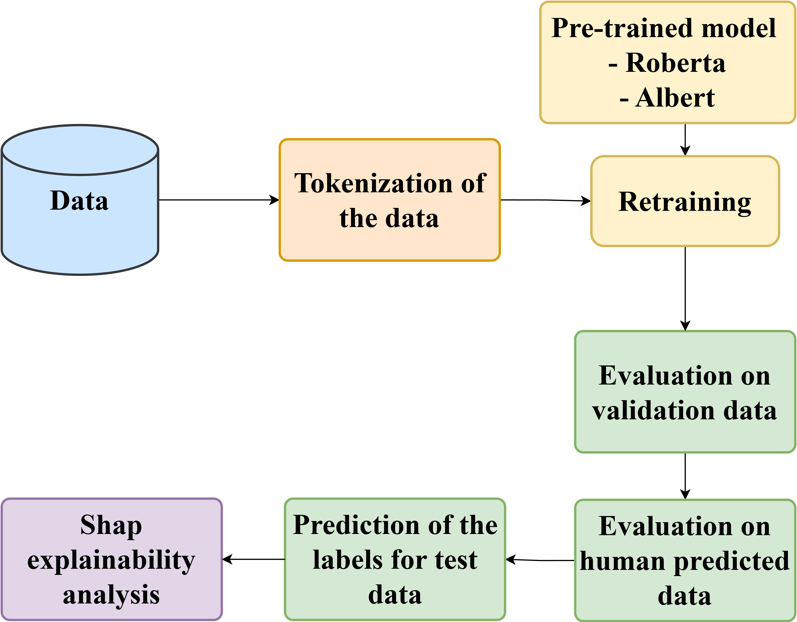
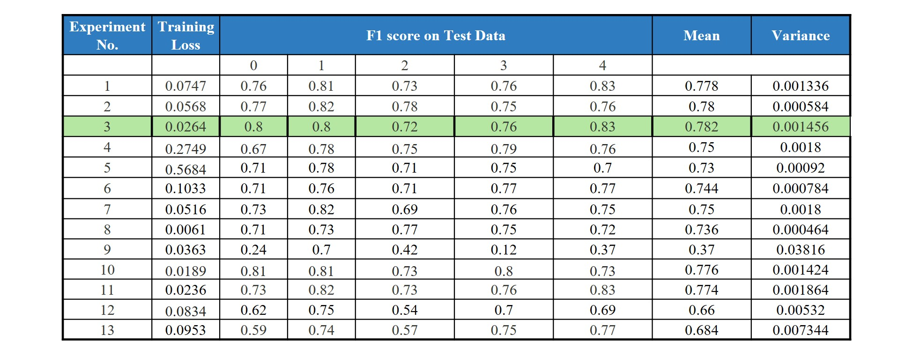
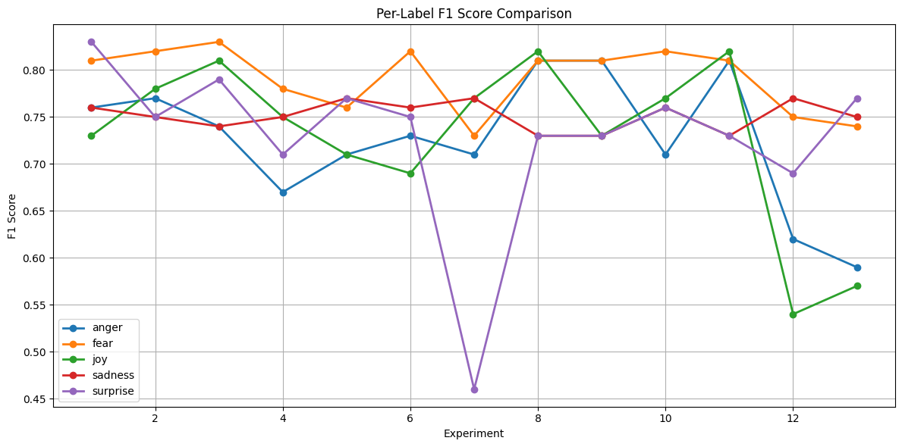
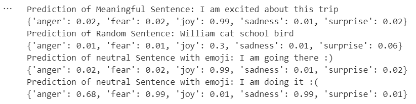
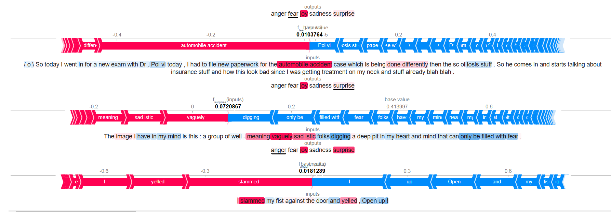

# Explainable Multi-Label Emotion Detection from Text Using Transformer-Based Language Models

Multi-label emotion classification on text, fine-tuning transformer language models
(RoBERTa, ALBERT) on the [SemEval 2025 Task 11-A](https://semeval.github.io/SemEval2025/) dataset,
with model explainability via SHAP and a human-evaluation comparison. ( "Originally completed in 2025")

## Problem

Given a piece of English text, predict which of five emotions it expresses (multi-label —
a text can carry more than one):

`anger`, `fear`, `joy`, `sadness`, `surprise`

## Approach

- **Base models**: `roberta-large` / `roberta-base` (primary) and `albert-base-v2` (comparison).
- **Classification head**: a 3-layer MLP on top of the pooled `[CLS]` embedding
  (`hidden_size -> 512 -> 256 -> 5`), each layer with LayerNorm, ReLU, and Dropout.
- **Loss**: `BCEWithLogitsLoss` (multi-label), optimized with AdamW and a linear LR scheduler.
- **Experiment sweep**: activation function (ReLU/GELU), number of fine-tuned transformer
  layers (3 / 5 / all), learning rate, batch size, and data augmentation — to isolate what
  actually moves the F1 score.
- **Data augmentation**: synonym replacement (WordNet) and back-translation
  (English → German → English), tested as an add-on to training data.
- **Explainability**: [SHAP](https://shap.readthedocs.io/) token-attribution analysis on
  model predictions, to see which words drive each emotion label.
- **Human evaluation**: a manually-labeled subset of the test data, compared against model
  predictions, to gauge how well the model's notion of "emotion" matches human judgment.



## Repo structure

```
notebooks/
  roberta_3layer_head.ipynb   RoBERTa-large + 3-layer classification head (1024->512->256->5)
                              Full pipeline: training, evaluation, SHAP explainability, human eval
  roberta_2layer_head.ipynb   RoBERTa-large + 2-layer classification head (1024->512->5)
  albert_finetuning.ipynb     Same pipeline, ALBERT (albert-base-v2) instead of RoBERTa
  data_augmentation.ipynb     RoBERTa pipeline with synonym-replacement + back-translation augmentation
results/
  Result_table.xlsx           Per-experiment F1 scores, variance, and configuration summary
assets/                       Result plots referenced below
```

Each notebook is self-contained (built for Google Colab — it mounts Google Drive for the
dataset and model checkpoints). The SemEval dataset itself isn't redistributed here; get it
from the [official task page](https://semeval.github.io/SemEval2025/) and point `dataset_path`
at your own copy.

## Results

Across 13 experiment configurations (hyperparameters, activation, layer depth, augmentation),
the best RoBERTa configuration reached a **mean F1 of 0.782**. ALBERT trailed noticeably
behind, at **0.66–0.684** mean F1 — it struggled to capture the more subtle emotional cues
RoBERTa picked up on.



*Experiments 1–11 fine-tune RoBERTa; experiments 12–13 fine-tune ALBERT (`albert_finetuning.ipynb`) — experiment 3 (RoBERTa) is the best overall.*



Two findings that ran counter to expectations:
- **Fine-tuning more transformer layers hurt performance** — beyond 3 fine-tuned layers,
  models started overfitting rather than improving.
- **Data augmentation (synonym replacement, back-translation) did not help** — small
  word-level changes could shift a sentence's emotional meaning, adding label noise instead
  of useful variation.

### Human evaluation

Model predictions were also compared against a manually-labeled subset of the test set.
Agreement was noticeably lower than on the structured test split (mean F1 ≈ 0.52 vs. ≈0.78),
with strong per-label variation — e.g. `fear` (F1 = 0.75) and `surprise` (F1 = 0.52) held up
reasonably well, while `anger` (F1 = 0.21) and `sadness` (F1 = 0.00) did not. This gap largely
reflects genuine subjectivity in how people label emotion in text, rather than a model
failure mode. The model also picked up on emoji cues (`:)` → `joy`, `:(` → `fear`/`sadness`)
even in otherwise neutral sentences.



### Explainability (SHAP)

SHAP token-attribution was used to inspect *why* the model predicted a given label — e.g.
phrases like "automobile accident" strongly drove `fear`, while words like "vaguely" and
"sadistic" pushed toward `sadness`.



## Limitations

- Restricted to English-language text; no multilingual evaluation.
- Emotion labels in the source dataset reflect individual annotator interpretation, which is
  inherently subjective — this is visible in the human-evaluation gap above.
- Standard augmentation techniques (synonym replacement, back-translation) proved unsuitable
  for this task; more targeted methods (e.g. sentiment-preserving paraphrasing, adversarial
  augmentation) would be a better next step.

## How to run

1. **Get the dataset.** These notebooks train on the SemEval 2025 Task 11-A English track
   (`train/eng.csv`, `dev/eng.csv`). It isn't redistributed in this repo — download it from the
   [official task page](https://semeval.github.io/SemEval2025/).
2. **Open a notebook** from `notebooks/` in [Google Colab](https://colab.research.google.com/)
   (they were built and run there, with a GPU runtime).
3. **Upload the dataset to Google Drive** and update `dataset_path` in the notebook's second
   cell to point at it (default: `/content/drive/My Drive/SemEval`).
4. **Run all cells.** Each notebook mounts Drive, tokenizes the data, fine-tunes the model, and
   reports a `classification_report` (precision/recall/F1 per emotion label) at the end.

To run locally instead of on Colab, install dependencies and remove the `google.colab.drive`
mount cell, pointing `dataset_path` at a local directory instead:

```
pip install -r requirements.txt
```

A GPU is strongly recommended — these notebooks fine-tune `roberta-large` (355M parameters).
